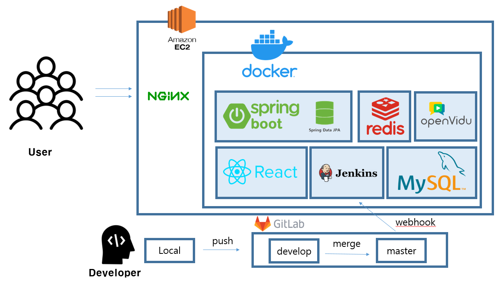

# DOLBOM

심리 상담사를 위한 온라인 상담 플랫폼
 
# 프로젝트 개요
- 진행기간 : 2022.01.02 ~ 2022.02.17
- 목표
    - WebRTC 기술을 사용해 비대면 화상 스터디 플랫폼 제작
    - 심리상담사를 위한 올인원 상담 플랫폼 목표
    - 일정 관리부터 상담 후 자료 관리까지 상담 프로세스 전반적인 업무 관리

- 와이어프레임

- ERD

 

# 프로젝트 소개
## 기획 배경
- 코로나로 인해 증가한 온라인 상담
- 심리상담사들 입장에서 편하게 사용할 수 있는 플랫폼의 필요성

# 주요 기능
## 스케줄링
> 스케줄을 편하게 관리
- 로그인
 

   
- 내담자 신규생성
 

   
- 스케줄 신규 생성
 

   
- 스케줄 수정
 

   
- 스케줄 조회(월,주,일) + 드래그앤드롭으로 수정 
 

   
- 스케줄 삭제
 

   
## 내담자 관리
> 내담자를 한 곳에서 관리
## 파일 관리
> 내담자 별로 상담 자료 편리하게 저장 가능
## 온라인 상담
> 비대면 상담 진행

 

# 아키텍처

 

# 개발환경
- OS: Windows10
- Backend Framework: Spring Boot 2.7.8
- Frontend Framework: React 17
- DB: MySQL Ver 8.0.32, Redis Ver 7.0.8
- WAS: Gradle
- JVM: OpenJDK version 11
- WebRTC: openVidu 2.25.0

 

# 배포환경
- exec 폴더 참조

 

# 팀원
- 이충무 : 팀장 Backend
- 이재훈 : Backend
- 박종수 : Backend
- 박현우 : Frontend
- 박승빈 : Frontend
